# Balanço Positivo | Despesas Pessoais

> Plataforma full stack para controle de finanças pessoais, com **API RESTful em ASP.NET Core**, **SPA Angular/Ionic**, autenticação JWT, persistência relacional, upload de imagem de perfil, gráficos financeiros, health checks e testes automatizados.


## 📌 Sumário

- [🧭 Visão Geral](#-visão-geral)
- [🔎 Análise Técnica](#-análise-técnica)
- [🏗️ Arquitetura](#️-arquitetura)
- [📐 Diagramas Técnicos](#-diagramas-técnicos)
- [🔄 Fluxos de Execução](#-fluxos-de-execução)
- [🧱 Padrões e Decisões](#-padrões-e-decisões)
- [📁 Estrutura do Repositório](#-estrutura-do-repositório)
- [🧩 Backend .NET](#-backend-net)
- [🌐 API REST](#-api-rest)
- [🖥️ Frontend Angular/Ionic](#️-frontend-angularionic)
- [🔐 Segurança](#-segurança)
- [🗄️ Dados e Migrations](#️-dados-e-migrations)
- [🐳 Docker](#-docker)
- [🚀 Execução Local](#-execução-local)
- [✅ Testes e Cobertura](#-testes-e-cobertura)
- [⚙️ CI/CD](#️-cicd)
- [🔁 Sincronização de PRs](#-sincronização-de-prs)
- [🧭 Observações Importantes](#-observações-importantes)
- [📄 Licença](#-licença)

## 🧭 Visão Geral

O **Balanço Positivo** é uma aplicação para gestão de despesas pessoais. O projeto permite cadastrar usuários, autenticar acessos, organizar categorias, registrar despesas e receitas, consultar lançamentos por período, calcular saldo, gerar dados para gráficos e gerenciar imagem de perfil.

A solução é composta por:

- 🌐 **API RESTful** em ASP.NET Core, documentada com Swagger e protegida por JWT Bearer.
- 🖥️ **Frontend Angular 20** com Ionic/Capacitor para web e bases mobile Android/iOS.
- 🧠 **Camada de domínio** com entidades financeiras e objetos de valor.
- ⚙️ **Camada de aplicação** com regras de negócio, DTOs, AutoMapper e autenticação.
- 🗄️ **Persistência EF Core 9** com suporte a MySQL, SQL Server e Oracle.
- 🔌 **Cross-cutting** com CQRS/MediatR para operações genéricas.
- ☁️ **Infraestrutura** para Amazon S3, e-mail, health checks e configuração de banco.
- 🧪 **Testes automatizados** com xUnit, Bogus, Moq.EntityFrameworkCore, Coverlet e Karma/Jasmine.
- 🐳 **Docker Compose** para ambientes local, desenvolvimento, staging e produção.

## 🔎 Análise Técnica

O projeto evoluiu de uma API acadêmica de finanças pessoais para uma solução modular com backend, frontend, infraestrutura, migrations e testes. A arquitetura atual separa responsabilidades em projetos distintos e usa injeção de dependência para compor o runtime no `Program.cs`.

| Aspecto | Análise |
| --- | --- |
| 🧭 Domínio | O domínio está centrado em `Usuario`, `Acesso`, `Categoria`, `Despesa`, `Receita`, `Lancamento`, `Saldo`, `Grafico` e `ImagemPerfilUsuario`. |
| 🧱 Organização | A solução evita concentrar regra de negócio nos controllers; controllers chamam interfaces de application business. |
| ⚙️ Aplicação | `Application` agrega DTOs, AutoMapper, validações de fluxo, autenticação, criptografia e services de negócio. |
| 🗄️ Persistência | `Repository` e `Infrastructure` separam repositórios, Unit of Work, DbContext e providers de banco. |
| 🔐 Segurança | JWT Bearer com certificado opcional, roles `User` e `Admin`, criptografia de senha com EasyCryptoSalt e extração de `sub` do token. |
| 📈 Observabilidade | Health checks expõem `/health` e `/health-ui` em desenvolvimento/staging. |
| 🧪 Testabilidade | Há cobertura para controllers, application, domain, infrastructure, repository, mapping, DI e Angular. |
| 📱 Multiplataforma | O frontend usa Angular, Ionic e Capacitor, com workspaces para Android e iOS. |

### Pontos Fortes

- Separação consistente entre `Domain`, `Application`, `Repository`, `Infrastructure`, `CrossCutting`, `GlobalException` e `WebApi`.
- Controllers pequenos, focados em HTTP, autenticação, autorização e delegação para business services.
- Repositórios genéricos e específicos, com Unit of Work para coordenar persistência.
- Migrations separadas por provider: MySQL, SQL Server e Oracle.
- Health checks configuráveis por `appsettings`.
- Frontend com rotas protegidas por guard e services isolados por recurso.
- Testes cobrindo desde value objects e DTOs até controllers e injeção de dependência.

### Cuidados Mapeados

| Ponto | Observação |
| --- | --- |
| 🔑 Segredos | `appsettings*.json` contém exemplos de chaves, senhas e credenciais. Para produção, use variáveis de ambiente, secrets de pipeline ou secret manager. |
| 🧪 Target framework | Os projetos estão em `net10.0`; a máquina local precisa ter SDK compatível instalado. |
| 🗄️ Provider ativo | O `Program.cs` registra MySQL por padrão via `ConfigureMySqlServerContext`. SQL Server e Oracle estão disponíveis, mas comentados. |
| 🌐 Referências externas | Links externos instáveis e imagens remotas foram removidos do README principal para manter a documentação alinhada ao estado local do projeto. |
| 🔒 Endpoints ocultos | Alguns endpoints existem no código com `ApiExplorerSettings(IgnoreApi = true)` e não aparecem no Swagger. |

## 🏗️ Arquitetura

A solução segue uma arquitetura em camadas com separação explícita entre interface, aplicação, domínio, persistência e infraestrutura. O `Program.cs` da WebApi é o ponto de composição do runtime: registra CORS, controllers, versionamento Swagger, DbContext, JWT, criptografia, AutoMapper, S3, repositórios, serviços de aplicação, CQRS, middleware global de exceções, arquivos estáticos e health checks.

| Camada | Projetos | Responsabilidade técnica |
| --- | --- | --- |
| Interface | `WebApi`, `AngularApp` | Exposição HTTP, SPA, guards, services TypeScript, Swagger, fallback para `index.html` e health endpoints. |
| Aplicação | `Application` | Casos de uso, DTOs, AutoMapper, autenticação, validações de fluxo, geração de token e orquestração de repositórios. |
| Domínio | `Domain` | Entidades financeiras, objetos de valor, estados e regras que não dependem de framework. |
| Persistência | `Repository`, `Repository.Mapping` | Repositórios, Unit of Work, queries especializadas e mapeamentos EF Core por provider. |
| Infraestrutura | `Infrastructure`, `Migrations`, `GlobalException`, `CrossCutting` | DbContext, providers SQL, Amazon S3, e-mail, migrations, seeders, tratamento global de erros e CQRS genérico. |

### Visão em Camadas

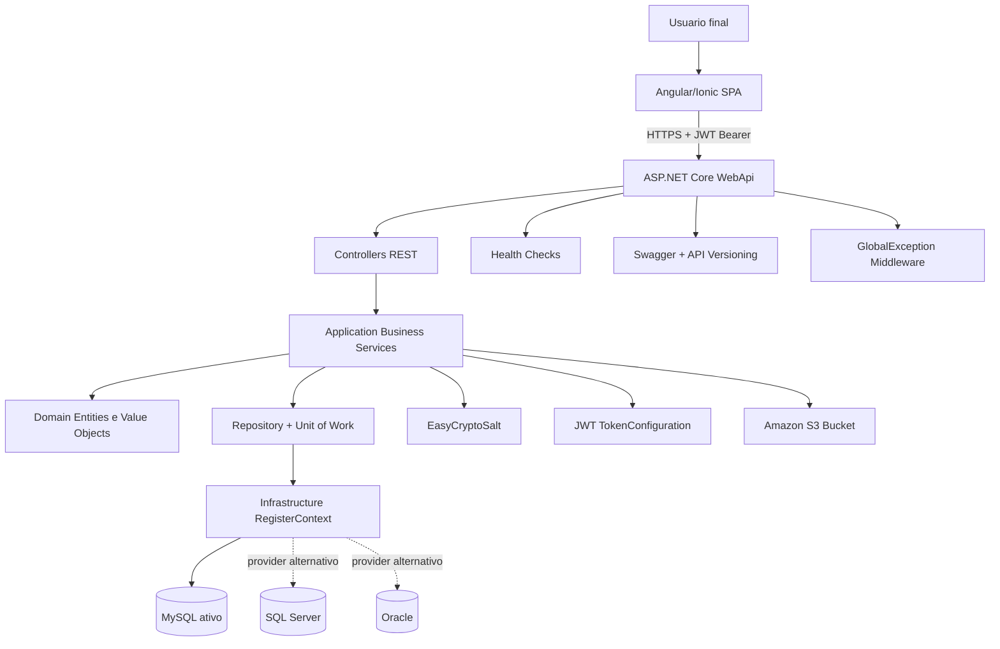

### Dependências entre Projetos

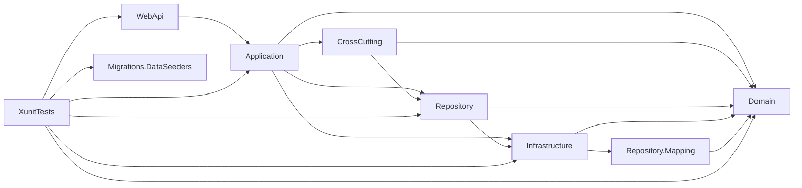

### Pipeline HTTP

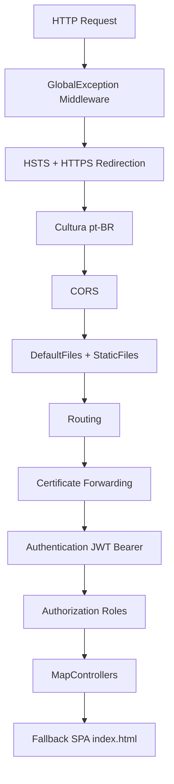

## 📐 Diagramas Técnicos

### Modelo de Domínio

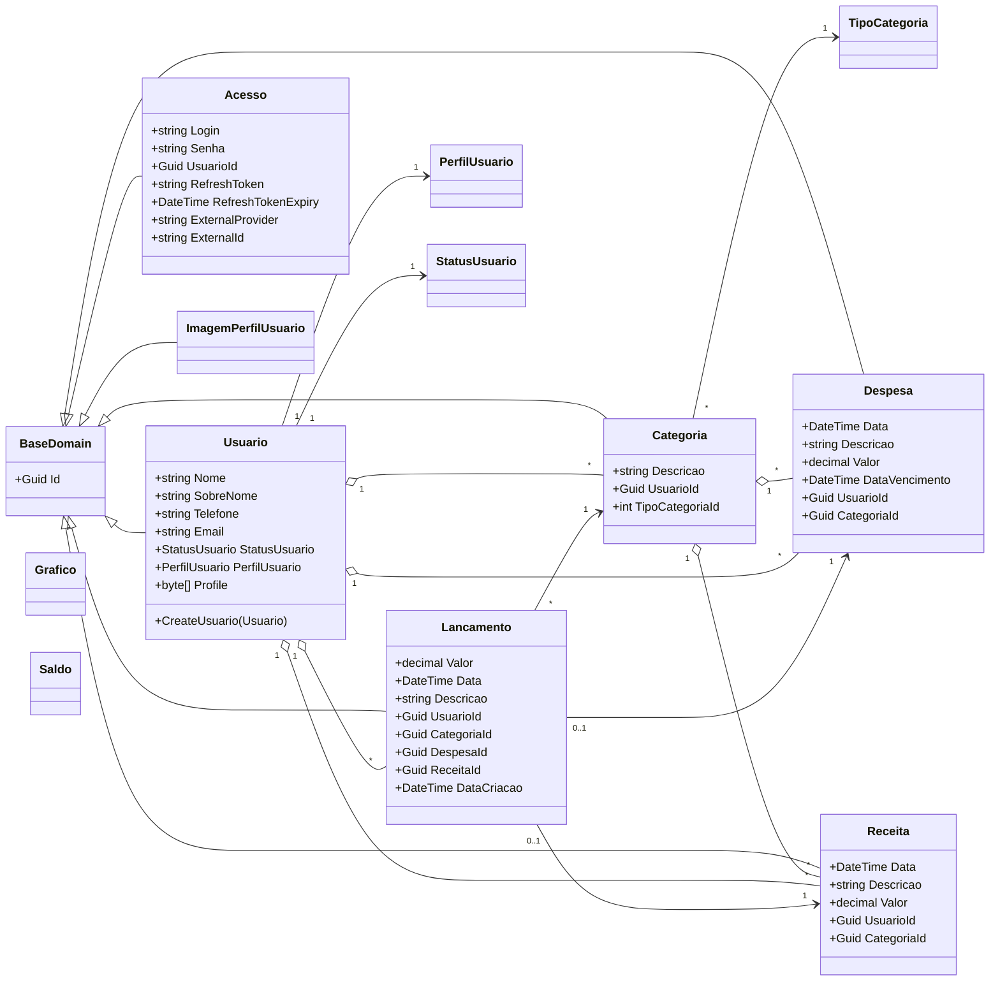

### Modelo Conceitual de Dados

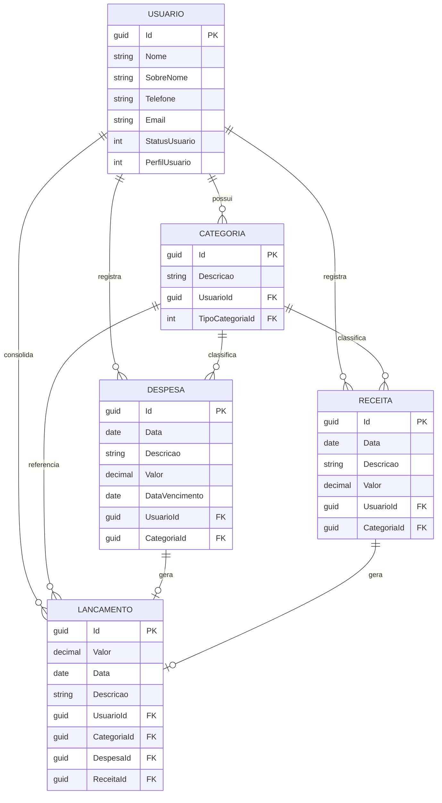

### Componentes do Frontend

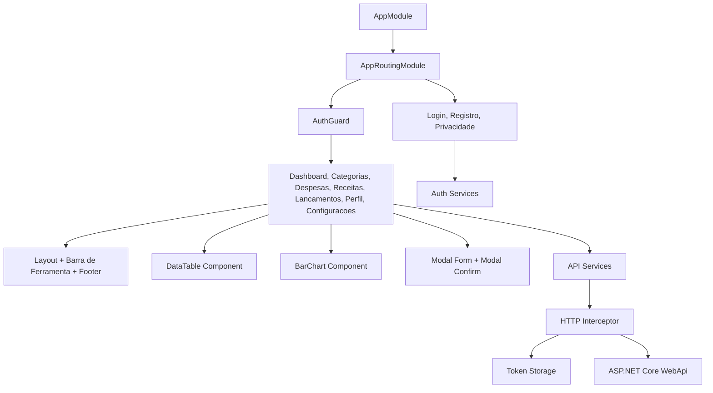

### Estratégia de Deploy

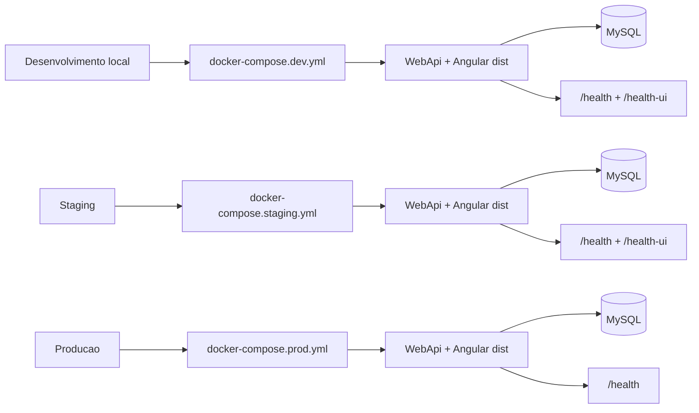

## 🔄 Fluxos de Execução

### Cadastro e Autenticação

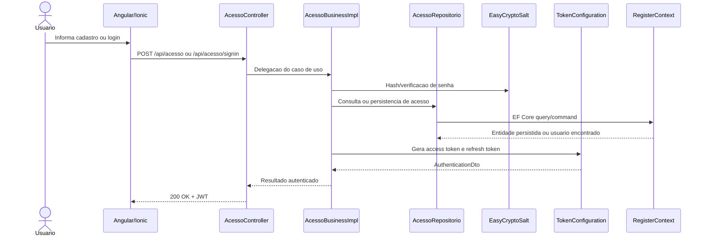

### Registro de Despesa ou Receita

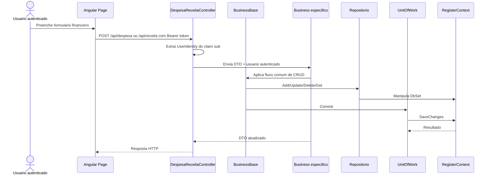

### Dashboard Financeiro

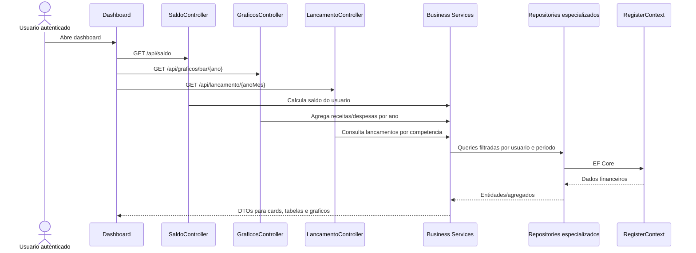

### Imagem de Perfil

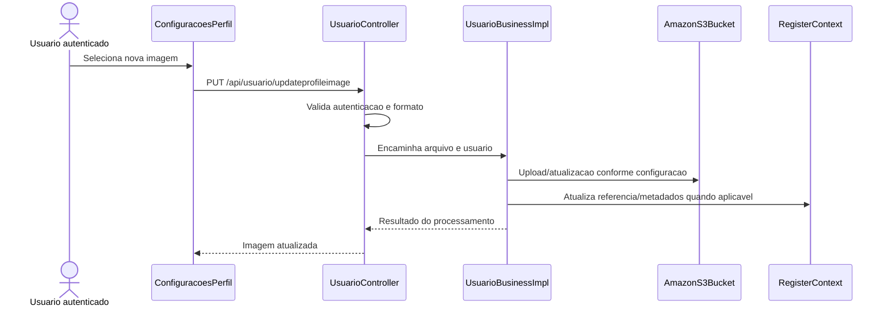

## 🧱 Padrões e Decisões

| Padrão/Decisão | Onde Aparece | Objetivo |
| --- | --- | --- |
| 🧱 **Arquitetura em camadas** | `Domain`, `Application`, `Repository`, `Infrastructure`, `WebApi` | Separar domínio, casos de uso, persistência, infraestrutura e HTTP. |
| 🧩 **Domain-Driven Design leve** | [`src/Domain`](src/Domain) | Modelar conceitos financeiros e de acesso como entidades e objetos de valor. |
| 📦 **Repository Pattern** | [`src/Repository/Persistency`](src/Repository/Persistency) | Encapsular consultas e comandos de dados. |
| 🔁 **Unit of Work** | [`src/Repository/UnitOfWork`](src/Repository/UnitOfWork) | Coordenar operações de persistência e commits. |
| 🧭 **Service/Business Layer** | [`src/Application/Implementations`](src/Application/Implementations) | Centralizar regras de aplicação fora dos controllers. |
| 🧬 **CQRS com MediatR** | [`src/CrossCutting/CQRS`](src/CrossCutting/CQRS) | Disponibilizar comandos e queries genéricas para create, update, delete, get all e get by id. |
| 🔁 **DTO + AutoMapper** | [`src/Application/Dtos`](src/Application/Dtos) | Proteger o domínio e controlar contratos de entrada/saída. |
| 🛡️ **Global Exception Middleware** | [`src/GlobalException`](src/GlobalException) | Padronizar tratamento de exceções e mensagens de erro. |
| 🔐 **JWT Bearer** | [`src/WebApi/CommonDependenceInject/AutorizationDependenceInject.cs`](src/WebApi/CommonDependenceInject/AutorizationDependenceInject.cs) | Proteger endpoints por autenticação e roles. |
| ☁️ **Adapter de infraestrutura** | [`src/Infrastructure/Amazon`](src/Infrastructure/Amazon) | Isolar integração com S3 por interface. |

## 📁 Estrutura do Repositório

```text
.
├── src/
│   ├── AngularApp/              SPA Angular 20, Ionic e Capacitor
│   ├── Application/             DTOs, business services, AutoMapper e autenticação
│   ├── CrossCutting/            CQRS, MediatR e configurações transversais
│   ├── Domain/                  Entidades, objetos de valor e extensões de domínio
│   ├── GlobalException/         Middleware e exceções customizadas
│   ├── Infrastructure/          DbContext, Amazon S3, e-mail e providers de banco
│   ├── Migrations/              Migrations e seeders por provider
│   ├── Repository/              Repositórios, Unit of Work e contratos
│   ├── Repository.Mapping/      Mapeamentos EF Core por entidade/provider
│   ├── WebApi/                  API REST, Swagger, JWT, health checks e host da SPA
│   └── XunitTests/              Testes automatizados .NET
├── docker-compose*.yml          Compose para local/dev/staging/prod
├── sln-Despesas.sln             Solution principal
└── README.md
```

## 🧩 Backend .NET

### Projetos

| Projeto | Responsabilidade |
| --- | --- |
| [`src/WebApi`](src/WebApi) | Controllers REST, Swagger, JWT, CORS, health checks, SPA fallback e bootstrap. |
| [`src/Application`](src/Application) | Business services, DTOs, AutoMapper, token, criptografia e e-mail. |
| [`src/Domain`](src/Domain) | Entidades, objetos de valor e regras de domínio. |
| [`src/Repository`](src/Repository) | Repositórios genéricos/específicos e Unit of Work. |
| [`src/Repository.Mapping`](src/Repository.Mapping) | Configurações EF Core de tabelas, campos e relacionamentos. |
| [`src/Infrastructure`](src/Infrastructure) | `RegisterContext`, providers SQL, Amazon S3 e EmailSender. |
| [`src/CrossCutting`](src/CrossCutting) | CQRS com MediatR e registros cross-cutting. |
| [`src/GlobalException`](src/GlobalException) | Exceções customizadas e middleware global. |
| [`src/XunitTests`](src/XunitTests) | Testes automatizados do backend. |

### Domínio

| Entidade/Objeto | Função |
| --- | --- |
| `Usuario` | Dados cadastrais, perfil, status, autenticação e vínculo com lançamentos. |
| `Acesso` | Fluxo de acesso, login, refresh token e troca/recuperação de senha. |
| `Categoria` | Classificação de receitas/despesas por usuário e tipo. |
| `Despesa` | Registro de saída financeira. |
| `Receita` | Registro de entrada financeira. |
| `Lancamento` | Representação consolidada de movimentos financeiros. |
| `Grafico` | Dados agregados para visualização anual/mensal. |
| `ImagemPerfilUsuario` | Metadados e conteúdo de imagem de perfil. |
| `PerfilUsuario` | Perfil/role do usuário (`User`, `Admin`). |
| `TipoCategoria` | Classificação de categorias de entrada/saída. |

### Business Services

| Interface | Implementação | Uso |
| --- | --- | --- |
| `IAcessoBusiness<AcessoDto, LoginDto>` | `AcessoBusinessImpl` | Cadastro, login, Google sign-in, refresh token e senha. |
| `ICategoriaBusiness<CategoriaDto, Categoria>` | `CategoriaBusinessImpl` | CRUD e filtro por tipo de categoria. |
| `IBusinessBase<DespesaDto, Despesa>` | `DespesaBusinessImpl` | CRUD de despesas por usuário. |
| `IBusinessBase<ReceitaDto, Receita>` | `ReceitaBusinessImpl` | CRUD de receitas por usuário. |
| `ILancamentoBusiness<LancamentoDto>` | `LancamentoBusinessImpl` | Consulta de lançamentos por mês/ano. |
| `ISaldoBusiness` | `SaldoBusinessImpl` | Saldo geral, anual e mensal. |
| `IGraficosBusiness` | `GraficosBusinessImpl` | Dados para gráfico de receitas/despesas. |
| `IUsuarioBusiness<UsuarioDto>` | `UsuarioBusinessImpl` | Perfil, usuários, imagem e dados pessoais. |
| `IImagemPerfilUsuarioBusiness<ImagemPerfilDto, UsuarioDto>` | `ImagemPerfilUsuarioBusinessImpl` | Fluxo legado/oculto de imagem de perfil. |

## 🌐 API REST

A API está em [`src/WebApi`](src/WebApi) e usa Swagger com versão `v3.0.0`.

URLs locais comuns:

| Recurso | URL |
| --- | --- |
| Swagger HTTPS | `https://localhost:42535/swagger` |
| Swagger HTTP | `http://localhost:42536/swagger` |
| Health check | `https://localhost:42535/health` |
| Health UI | `https://localhost:42535/health-ui` |

### Controllers e Endpoints

| Controller | Principais Rotas | Autorização | Responsabilidade |
| --- | --- | --- | --- |
| `AcessoController` | `POST /api/acesso`, `POST /api/acesso/signin` | Cadastro/login públicos; demais endpoints internos protegidos/ocultos | Cadastro de acesso, autenticação, refresh token, senha e Google sign-in. |
| `UsuarioController` | `GET /api/usuario`, `PUT /api/usuario`, `GET /api/usuario/getprofileimage`, `PUT /api/usuario/updateprofileimage` | `User`, `Admin`; criação/exclusão só `Admin` | Perfil, dados pessoais, imagem e administração de usuários. |
| `CategoriaController` | `GET /api/categoria`, `GET /api/categoria/getbyid/{id}`, `GET /api/categoria/getbytipocategoria/{tipo}`, `POST`, `PUT`, `DELETE` | `User`, `Admin` | Categorias por usuário e tipo. |
| `DespesaController` | `GET /api/despesa`, `GET /api/despesa/getbyid/{id}`, `POST`, `PUT`, `DELETE /api/despesa/{id}` | `User`, `Admin` | CRUD de despesas do usuário autenticado. |
| `ReceitaController` | `GET /api/receita`, `GET /api/receita/getbyid/{id}`, `POST`, `PUT`, `DELETE /api/receita/{id}` | `User`, `Admin` | CRUD de receitas do usuário autenticado. |
| `LancamentoController` | `GET /api/lancamento/{anoMes}` | `User`, `Admin` | Lançamentos consolidados por mês/ano. |
| `SaldoController` | `GET /api/saldo`, `GET /api/saldo/byano/{ano}`, `GET /api/saldo/bymesano/{anoMes}` | `User`, `Admin` | Saldo geral, anual e mensal. |
| `GraficosController` | `GET /api/graficos/bar/{ano}` | `User`, `Admin` | Dados para gráfico anual de despesas e receitas. |
| `ImagemPerfilUsuarioController` | Rotas CRUD de imagem | Desabilitado/oculto no Swagger | Fluxo legado de imagem, substituído por endpoints em `UsuarioController`. |

### Comportamentos de API

- URLs são normalizadas em minúsculo por `AddRouting(options => options.LowercaseUrls = true)`.
- Swagger UI é habilitado em ambientes diferentes de produção.
- `MapFallbackToFile("index.html")` permite servir a SPA Angular publicada.
- `UseGlobalExceptionHandler` centraliza tratamento de exceções customizadas.
- `UserIdentity` é extraído do claim `sub` do JWT em `UnitControllerBase`.
- Roles são aplicadas com `[Authorize("Bearer", Roles = "User, Admin")]`.

## 🖥️ Frontend Angular/Ionic

O frontend está em [`src/AngularApp`](src/AngularApp), usa Angular 20, Ionic 8, Capacitor 6, Bootstrap, Material, DataTables, Chart.js e ng2-charts.

### Rotas Principais

| Rota | Proteção | Descrição |
| --- | --- | --- |
| `/` | Pública | Login por lazy loading. |
| `/register` | Pública | Cadastro de acesso. |
| `/dashboard` | `AuthGuard` | Resumo financeiro e gráficos. |
| `/categoria` | `AuthGuard` | Gestão de categorias. |
| `/despesa` | `AuthGuard` | Gestão de despesas. |
| `/receita` | `AuthGuard` | Gestão de receitas. |
| `/lancamento` | `AuthGuard` | Consulta de lançamentos. |
| `/perfil` | `AuthGuard` | Dados do usuário. |
| `/configuracoes` | `AuthGuard` | Avatar, senha e exclusão de dados pessoais. |
| `/privacy` | Pública | Política/privacidade. |
| `**` | Pública | Página não encontrada. |

### Organização

| Área | Caminho | Conteúdo |
| --- | --- | --- |
| Pages | [`src/AngularApp/src/app/pages`](src/AngularApp/src/app/pages) | Login, acesso, dashboard, categorias, despesas, receitas, lançamentos, perfil, configurações e erros. |
| Components | [`src/AngularApp/src/app/components`](src/AngularApp/src/app/components) | Layout, footer, toolbar, data table, gráfico de barras, saldo, loading, alertas e modais. |
| Services API | [`src/AngularApp/src/app/services/api`](src/AngularApp/src/app/services/api) | Services para acesso, usuários, categorias, despesas, receitas, saldo, dashboard e imagem de perfil. |
| Auth | [`src/AngularApp/src/app/services/auth`](src/AngularApp/src/app/services/auth) | Autenticação local e Google. |
| Token | [`src/AngularApp/src/app/services/token`](src/AngularApp/src/app/services/token) | Armazenamento de token. |
| Models | [`src/AngularApp/src/app/models`](src/AngularApp/src/app/models) | Interfaces TypeScript para contratos da API. |
| Interceptors | [`src/AngularApp/src/interceptors`](src/AngularApp/src/interceptors) | Interceptor HTTP. |
| Mobile | [`src/AngularApp/app-android`](src/AngularApp/app-android), [`src/AngularApp/app-ios`](src/AngularApp/app-ios) | Workspaces Capacitor para builds mobile. |

### Scripts Frontend

```bash
cd src/AngularApp
npm install
npm start
npm run build
npm run build:staging
npm run build:local
npm run test:coverage
```

## 🔐 Segurança

| Recurso | Implementação |
| --- | --- |
| Autenticação | JWT Bearer em [`AutorizationDependenceInject`](src/WebApi/CommonDependenceInject/AutorizationDependenceInject.cs). |
| Assinatura | `SigningConfigurations` com certificado PFX quando configurado. |
| Roles | `User` e `Admin` via policies/claims. |
| Senhas | Criptografia/verificação com EasyCryptoSalt. |
| CORS | Origens separadas para produção e desenvolvimento. |
| Dados sensíveis | DTOs e schemas específicos ocultam detalhes sensíveis no Swagger. |
| Exceções | Middleware global e exceções customizadas por domínio. |
| Imagem | Upload restrito no controller para formatos de imagem aceitos. |

### Configurações Relevantes

| Seção | Arquivo | Uso |
| --- | --- | --- |
| `TokenConfigurations` | [`src/WebApi/appsettings*.json`](src/WebApi) | Issuer, audience, validade, certificado e senha. |
| `CryptoConfigurations` | [`src/WebApi/appsettings*.json`](src/WebApi) | Chave e salt de criptografia. |
| `AmazonS3Configurations` | [`src/WebApi/appsettings*.json`](src/WebApi) | Upload/consulta de imagem de perfil. |
| `HealthCheckOptions` | [`src/WebApi/appsettings.development.json`](src/WebApi/appsettings.development.json) | Endpoints monitorados por `/health` e `/health-ui`. |

> Em ambientes reais, substitua credenciais e secrets versionados por variáveis de ambiente ou ferramenta de secrets.

## 🗄️ Dados e Migrations

### Provider Ativo

O bootstrap atual usa MySQL:

```csharp
builder.Services.ConfigureMySqlServerContext(builder.Configuration);
```

SQL Server e Oracle estão disponíveis em [`SqlServicesInjectDependence`](src/Infrastructure/CommonDependenceInject/SqlServicesInjectDependence.cs), mas aparecem comentados no `Program.cs`.

### Providers Suportados

| Provider | Projeto de Migration | Connection String |
| --- | --- | --- |
| MySQL | [`src/Migrations/MySqlServer`](src/Migrations/MySqlServer) | `MySqlConnectionString` |
| SQL Server | [`src/Migrations/MsSqlServer`](src/Migrations/MsSqlServer) | `SqlServerConnectionString` |
| Oracle | [`src/Migrations/Oracle`](src/Migrations/Oracle) | `OracleConnectionString` |

### DbContext

| Classe | Caminho | Responsabilidade |
| --- | --- | --- |
| `RegisterContext` | [`src/Infrastructure/DatabaseContexts/RegisterContext.cs`](src/Infrastructure/DatabaseContexts/RegisterContext.cs) | DbContext principal da aplicação. |
| `BaseContext` | [`src/Infrastructure/DatabaseContexts/Abstractions/BaseContext.cs`](src/Infrastructure/DatabaseContexts/Abstractions/BaseContext.cs) | Configuração base do contexto e mapeamentos. |
| `DatabaseProvider` | [`src/Repository.Mapping/Abstractions/DatabaseProvider.cs`](src/Repository.Mapping/Abstractions/DatabaseProvider.cs) | Identifica provider usado pelos mappings. |

### Seeders

[`src/Migrations/DataSeeders`](src/Migrations/DataSeeders) contém:

- seed inicial de controle de acesso;
- seed de despesas;
- seed de receitas;
- updaters para evolução de dados;
- manutenção de banco para MySQL, SQL Server e Oracle.

## 🐳 Docker

### Compose Disponíveis

| Arquivo | Uso |
| --- | --- |
| [`docker-compose.yml`](docker-compose.yml) | Compose base da API. |
| [`docker-compose.dev.yml`](docker-compose.dev.yml) | Ambiente de desenvolvimento com portas `42535` e `42536`. |
| [`docker-compose.staging.yml`](docker-compose.staging.yml) | Staging com portas externas `42534` e `42533`. |
| [`docker-compose.prod.yml`](docker-compose.prod.yml) | Produção com portas `80` e `443`. |
| [`docker-compose.override.yml`](docker-compose.override.yml) | Override local do compose base. |
| [`docker-compose.net-sdk-wIth-node.yml`](docker-compose.net-sdk-wIth-node.yml) | Imagem auxiliar com .NET SDK e Node. |

### Desenvolvimento

```bash
docker compose -f docker-compose.dev.yml up --build
```

| Serviço | Porta | Observação |
| --- | --- | --- |
| API HTTPS | `42535` | Swagger e API em desenvolvimento. |
| API HTTP | `42536` | Endpoint HTTP local. |
| Angular dist | `./src/AngularApp/dist:/app/wwwroot` | SPA publicada servida pela WebApi. |
| Certificado | `./src/WebApi/certificate/webapi-cert.pfx` | Usado pelo Kestrel em Docker. |

## 🚀 Execução Local

### Pré-requisitos

- .NET SDK compatível com `net10.0`
- Node.js e npm
- Docker, se for usar containers
- MySQL local ou remoto compatível com `MySqlConnectionString`
- Certificado HTTPS local quando usar os scripts com SSL
- `dotnet-reportgenerator-globaltool` para relatório HTML de cobertura

### Backend

```bash
dotnet restore sln-Despesas.sln
dotnet build sln-Despesas.sln
dotnet run --project src/WebApi/WebApi.csproj
```

Swagger local:

```text
https://localhost:42535/swagger
http://localhost:42536/swagger
```

### Frontend

```bash
cd src/AngularApp
npm install
npm start
```

### Scripts Auxiliares

| Script | Uso |
| --- | --- |
| [`src/generate_coverage_report.sh`](src/generate_coverage_report.sh) | Coverage do backend no Linux. |
| [`src/generate_coverage_report.ps1`](src/generate_coverage_report.ps1) | Coverage do backend no Windows. |
| [`src/AngularApp/generate_coverage_report.sh`](src/AngularApp/generate_coverage_report.sh) | Coverage Angular no Linux. |
| [`src/AngularApp/generate_coverage_report.ps1`](src/AngularApp/generate_coverage_report.ps1) | Coverage Angular no Windows. |

## ✅ Testes e Cobertura

### Backend

```bash
dotnet test src/XunitTests/XUnit.Tests.csproj
```

Com coverage:

```bash
dotnet test src/XunitTests/XUnit.Tests.csproj \
  -p:CollectCoverage=true \
  -p:CoverletOutputFormat=cobertura \
  --collect:"XPlat Code Coverage"
```

### Frontend

```bash
cd src/AngularApp
npm test
npm run test:coverage
```

### Cobertura por Área

| Pasta | Valida |
| --- | --- |
| [`src/XunitTests/Api`](src/XunitTests/Api) | Controllers e respostas HTTP. |
| [`src/XunitTests/Application`](src/XunitTests/Application) | DTOs, business services, autenticação e regras de aplicação. |
| [`src/XunitTests/Domain`](src/XunitTests/Domain) | Entidades, value objects e extensões. |
| [`src/XunitTests/Infrastructure`](src/XunitTests/Infrastructure) | Integrações de infraestrutura, como Amazon S3. |
| [`src/XunitTests/Repository`](src/XunitTests/Repository) | Mappings, repositories, DbContext e Unit of Work. |
| [`src/XunitTests/CommonDependenceInject`](src/XunitTests/CommonDependenceInject) | Registros de DI e configurações transversais. |
| [`src/AngularApp/src/app`](src/AngularApp/src/app) | Components, pages, guards, services, interceptors e rotas. |

## ⚙️ CI/CD

Os workflows do GitHub Actions ficam em [`.github/workflows`](.github/workflows):

| Workflow | Finalidade |
| --- | --- |
| `build_development.yml` | Build de desenvolvimento. |
| `build_production.yml` | Build de produção. |
| `publish_dev_project.yml` | Publicação de desenvolvimento. |
| `publish_prod_project.yml` | Publicação de produção. |
| `sync-angularapp.yml` | Sincronização/build relacionado ao Angular. |
| `test_analyse_in_Sonar_Cloud.yml` | Testes e análise estática configurados no pipeline. |
| `tests_E2E.yml` | Testes end-to-end. |

## 🔁 Sincronização de PRs

O repositório mantém referências de sincronização para acompanhar a evolução
das branches do fork `HONEY-TI/prj-estacio-despesas-pessoais` em relação ao
repositório de origem `alexfariakof/app-despesas-pessoais`:

- [PR #192](https://github.com/alexfariakof/app-despesas-pessoais/pull/192)
  permanece aberta para o destino `dev`.
- [PR #193](https://github.com/alexfariakof/app-despesas-pessoais/pull/193)
  permanece aberta para o destino `main`.
- As PRs #191 e #194 foram encerradas e mantidas apenas como histórico.

As PRs abertas permanecem como referências de sincronização. Cada push na
branch de referência do fork atualiza a comparação exibida pelo GitHub.

## 🧭 Observações Importantes

- O README documenta apenas arquivos, comandos e recursos presentes neste repositório.
- Referências externas instáveis foram removidas por não fazerem parte do estado local do projeto.
- O ambiente local usa cultura `pt-BR`.
- O Swagger é desabilitado em produção pelo `Program.cs`.
- O provider de banco ativo no bootstrap atual é MySQL.
- Alguns endpoints existem no código, mas são ocultos do Swagger por `ApiExplorerSettings(IgnoreApi = true)`.
- A pasta `src/AngularApp` também contém workspaces mobile `app-android` e `app-ios`.

## 📄 Licença

Consulte [`LICENSE`](LICENSE) para os termos de uso, restrições e permissões aplicáveis ao projeto.
